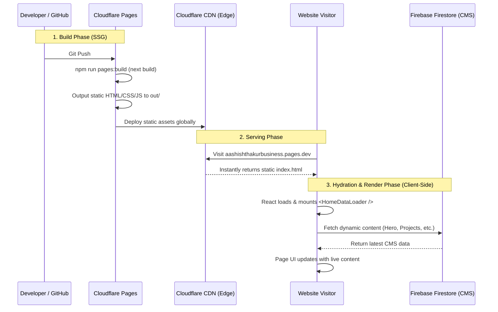

# Professional Personal Portfolio & CMS

A premium, state-of-the-art developer portfolio built using Next.js 16 (App Router) and integrated with a custom Firebase Content Management System (CMS). Deployed as a **Static Site (SSG)** on Cloudflare Pages to guarantee blazing-fast load times and to operate seamlessly within free-tier limits.

---

## 🚀 Key Features

* **Static Export Architecture**: Completely bypasses the Cloudflare Workers 3 MiB limit by utilizing Next.js static export (`output: 'export'`). The site is served entirely as pure HTML, CSS, and JS from Cloudflare's Edge CDN.
* **Live Firebase CMS**: Dynamic content delivery powered by Firestore (Hero, Projects, Services, Contact, etc.) with a secure Firebase Auth Admin Dashboard.
* **Client-Side Data Hydration**: Uses a custom `<HomeDataLoader />` component to fetch the latest CMS content directly from Firestore as soon as the static page loads. This means you get **instant, live content updates** when you edit your portfolio in the admin panel, without ever needing to trigger a new build.
* **Stunning Design Aesthetics**: Harmonies of dark glassmorphism, HSL-tailored premium color palettes, subtle micro-animations, and custom transitions.
* **Optimized Security**: Configured with strict Content Security Policy (CSP) headers that securely authorize communication between your Cloudflare domain and Google/Firebase APIs.

---

## 🛠️ Technology Stack

* **Framework**: Next.js 16.0.3 (App Router)
* **Hosting**: Cloudflare Pages (Static Assets)
* **Styling**: Vanilla CSS & Tailwind CSS (for admin panel)
* **Database & Authentication**: Firebase Firestore & Firebase Auth

---

## 🏗️ Architecture & Pipeline Flow

To understand how the site works in production, here is the exact data flow:

1. **Build Phase**: When you push code, Cloudflare Pages runs `npm run pages:build` (which executes `next build`). Because `next.config.mjs` has `output: 'export'`, Next.js generates static HTML/CSS files into the `out/` directory. Next.js does *not* query Firebase for dynamic content at this stage. It generates the layout and basic SEO metadata.
2. **Serving Phase**: When a user visits your site, Cloudflare's CDN instantly serves the static `index.html` file from the edge (extremely fast). 
3. **Hydration Phase**: As soon as the React code loads in the browser, the `HomeDataLoader` client component makes an asynchronous request to your Firebase Firestore database to fetch your Hero text, Projects, Contact info, etc.
4. **Render Phase**: The page is instantly hydrated with your live data. If you change a typo in your CMS Admin panel, the next user who visits (or refreshes) will immediately see the change because the data is fetched live from the client-side.



---

## 💻 Local Development

### 1. Environment Configuration
Create a `.env.local` file at the root of the project and populate it with your Firebase config:

```bash
NEXT_PUBLIC_FIREBASE_API_KEY=your_api_key
NEXT_PUBLIC_FIREBASE_AUTH_DOMAIN=your_auth_domain
NEXT_PUBLIC_FIREBASE_PROJECT_ID=your_project_id
NEXT_PUBLIC_FIREBASE_STORAGE_BUCKET=your_storage_bucket
NEXT_PUBLIC_FIREBASE_MESSAGING_SENDER_ID=your_messaging_sender_id
NEXT_PUBLIC_FIREBASE_APP_ID=your_app_id
NEXT_PUBLIC_FIREBASE_MEASUREMENT_ID=your_measurement_id
```

### 2. Run the Development Server
Install dependencies and run Next.js locally:

```bash
npm install
npm run dev
```

Open [http://localhost:3000](http://localhost:3000) to view the application.

---

## ☁️ Production Build & Cloudflare Deployment

The application compiles into a static directory (`out/`). No Server-Side Rendering (SSR) or Edge Workers are required, keeping your deployment fast, simple, and 100% free.

### 1. Build Commands
To test the production build locally:

```bash
npm run pages:build
```
This will generate the `out/` directory containing all static assets.

### 2. Cloudflare Pages Setup
When configuring the deployment dashboard in Cloudflare Pages:

1. **Build Command**: `npm run pages:build`
2. **Build Output Directory**: `out`
3. **Framework Preset**: `None`
4. **Environment Variables**: Add all your `NEXT_PUBLIC_FIREBASE_` environment variables directly into the Cloudflare Pages settings (Settings -> Environment variables -> Production & Preview).

### 3. Firebase Auth & Security (Troubleshooting Login)
Because the app communicates directly with Firebase from the browser, Google Cloud security policies apply strictly:

1. **Firebase Authorized Domains**: If you deploy to a new domain (like a custom `.com.np` or a new `.pages.dev` URL), you **must** add it to Firebase Console -> Authentication -> Settings -> Authorized Domains.
2. **CSP Headers**: The file `public/_headers` contains the `Content-Security-Policy`. If you ever add new external services (like a new image host, analytics, or database), you **must** add those domains to the CSP directives (`connect-src`, `img-src`, `script-src`) in the `public/_headers` file, otherwise the browser will block them.
3. **Google Cloud API Key Restrictions**: Ensure your Firebase API key in Google Cloud Console is unrestricted or specifically allows HTTP referrers from your production domains, and that the **Identity Toolkit API** is enabled.
